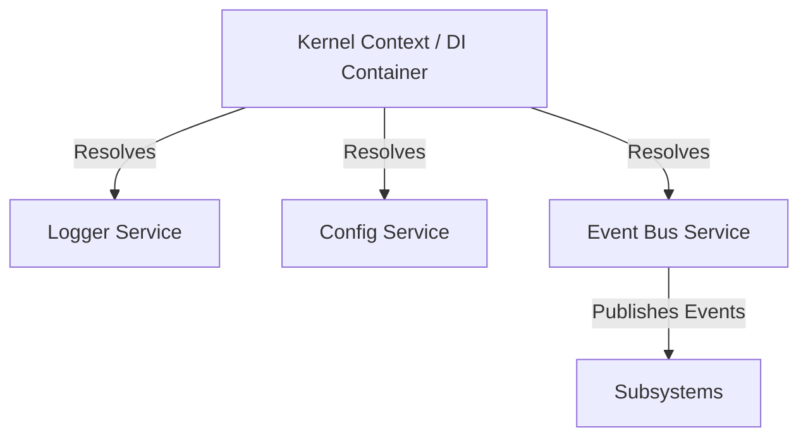

# Sprint 1: Monorepo Foundation & Baseline Core Services

This sprint establishes the monorepo structure, formatting/linting rules, CI pipeline, testing harnesses, and foundational cross-cutting services (Logging, Configuration, Dependency Injection, Event Bus).

---

## 1. System Boundaries & Monorepo Architecture

We utilize a dual-language monorepo structure:
- **TypeScript Workspace**: Orchestrated via npm workspaces. Handles Desktop GUI (Electron/React), workspace tools, and sandbox runtime shells.
- **Python Workspace**: Orchestrated via `pyproject.toml` paths or poetry/uv workspaces. Handles cognitive agents, LangGraph planning logic, and machine learning/embedding retrieval.

### Workspace Directory Layout
```
e:\Antigravity-clone/ (Monorepo Root)
├── .github/
│   └── workflows/
│       └── ci.yml              # GitHub Actions CI pipeline
├── apps/
│   ├── desktop/                # Electron + React App (TypeScript)
│   └── backend/                # FastAPI Daemon (Python)
├── packages/
│   ├── shared/                 # Core TypeScript types, RPC schemas, error definitions
│   └── core/                   # TS Core Services: EventBus, Logger, DI, Config
├── .eslintrc.json              # Monorepo ESLint Config
├── .prettierrc                 # Monorepo Formatting Config
├── pyproject.toml              # Python Workspace settings (Ruff, Pytest)
├── package.json                # Root package.json (npm workspaces definition)
└── tsconfig.json               # Root TS configuration
```

---

## 2. Core Service Designs & Interface Contracts

We define four baseline core services that will be shared across all TypeScript packages:



### A. Logging Subsystem
Provides structured JSON logs to standard output, write-rotated local files, and live GUI debug consoles.

```typescript
// packages/core/src/logging/interface.ts
export type LogLevel = 'debug' | 'info' | 'warn' | 'error';

export interface ILogger {
  debug(message: string, meta?: Record<string, any>): void;
  info(message: string, meta?: Record<string, any>): void;
  warn(message: string, meta?: Record<string, any>): void;
  error(message: string, error?: Error, meta?: Record<string, any>): void;
  child(bindings: Record<string, any>): ILogger;
}
```

### B. Configuration Subsystem
Loads environmental values (`.env`), processes defaults, and validates types at boot time.

```typescript
// packages/core/src/config/interface.ts
import { z } from 'zod';

export const ConfigSchema = z.object({
  NODE_ENV: z.enum(['development', 'production', 'test']).default('development'),
  PORT: z.coerce.number().default(4000),
  WORKSPACE_ROOT: z.string(),
  OLLAMA_API_URL: z.string().url().default('http://localhost:11434'),
  DATABASE_PATH: z.string().default('./forge.db'),
  LOG_LEVEL: z.enum(['debug', 'info', 'warn', 'error']).default('info'),
});

export type IConfig = z.infer<typeof ConfigSchema>;

export interface IConfigService {
  get<K extends keyof IConfig>(key: K): IConfig[K];
  getAll(): Readonly<IConfig>;
}
```

### C. Dependency Injection (DI) Container
A clean, minimal, non-reflective dependency injection container mapping interface tokens to concretes.

```typescript
// packages/core/src/di/container.ts
export type Token<T = any> = string | symbol | { new (...args: any[]): T };

export interface IDIContainer {
  register<T>(token: Token<T>, provider: { new (...args: any[]): T }): void;
  registerInstance<T>(token: Token<T>, instance: T): void;
  resolve<T>(token: Token<T>): T;
  clear(): void;
}
```

### D. Event Bus Subsystem
Maintains event communication across packages via typed system channels.

```typescript
// packages/core/src/eventbus/interface.ts
export interface IEvent<TPayload = any> {
  topic: string;
  timestamp: Date;
  payload: TPayload;
}

export type EventHandler<T = any> = (event: IEvent<T>) => void | Promise<void>;

export interface IEventBus {
  publish<T>(topic: string, payload: T): void;
  subscribe<T>(topic: string, handler: EventHandler<T>): string; // Returns subscription ID
  unsubscribe(subscriptionId: string): void;
}
```

---

## 3. Tooling & Workspace Infrastructure Specifications

### Linting & Formatting
1.  **TypeScript**:
    *   **Linter**: ESLint with typescript-eslint rules, enforcing strict typings, no implicit returns, and no raw `any` types where avoidable.
    *   **Formatter**: Prettier configured with 2-space tab indent, double quotes, and trailing commas.
2.  **Python**:
    *   **Linter & Formatter**: Ruff configuration in `pyproject.toml`. Checks styling, unused imports, docstring standards, and syntax complexity. Enforces PEP8 formatting rules.

### Testing Engines
-   **TypeScript**: **Vitest** runner configured for parallel test runs and automatic coverage reports.
-   **Python**: **Pytest** runner with coverage plugins (`pytest-cov`).

### Continuous Integration (CI)
GitHub Actions workflow executing on every Pull Request:
- Checks out code.
- Installs dependencies (Node modules + Python environment).
- Performs formatting validation checks.
- Runs ESLint and Ruff checkers.
- Spawns TypeScript test suites and Pytest test suites.

---

## 4. Proposed File Changes & Implementations

Below are the list of files to generate in Sprint 1:

### Root Configurations
#### [NEW] [package.json](file:///e:/Antigravity-clone/package.json)
Sets up npm workspaces.
```json
{
  "name": "forge-monorepo",
  "private": true,
  "workspaces": [
    "apps/*",
    "packages/*"
  ],
  "scripts": {
    "bootstrap": "npm install",
    "build": "npm run build --workspaces --if-present",
    "lint": "npm run lint --workspaces --if-present",
    "format:check": "prettier --check \"**/*.{ts,tsx,js,json,md}\"",
    "format:write": "prettier --write \"**/*.{ts,tsx,js,json,md}\"",
    "test": "npm run test --workspaces --if-present"
  },
  "devDependencies": {
    "prettier": "^3.0.0",
    "typescript": "^5.0.0"
  }
}
```

#### [NEW] [pyproject.toml](file:///e:/Antigravity-clone/pyproject.toml)
Python workspace and lint rules (Ruff).
```toml
[tool.ruff]
line-length = 88
select = ["E", "F", "I", "N"]
ignore = []

[tool.pytest.ini_options]
minversion = "7.0"
addopts = "-ra -q --cov"
testpaths = [
    "apps/backend/tests",
    "packages/*/tests"
]
```

### Shared Package Core
#### [NEW] [packages/core/package.json](file:///e:/Antigravity-clone/packages/core/package.json)
```json
{
  "name": "@forge/core",
  "version": "0.1.0",
  "main": "dist/index.js",
  "types": "dist/index.d.ts",
  "scripts": {
    "build": "tsc",
    "test": "vitest run",
    "lint": "eslint \"src/**/*.ts\""
  },
  "dependencies": {
    "zod": "^3.22.0",
    "dotenv": "^16.3.0",
    "winston": "^3.10.0"
  },
  "devDependencies": {
    "vitest": "^1.0.0"
  }
}
```

#### [NEW] [packages/core/src/di/container.ts](file:///e:/Antigravity-clone/packages/core/src/di/container.ts)
Implementation of DI container using mapping.
```typescript
import { Token, IDIContainer } from './interface';

export class DIContainer implements IDIContainer {
  private instances = new Map<Token, any>();
  private mappings = new Map<Token, { new (...args: any[]): any }>();

  register<T>(token: Token<T>, provider: { new (...args: any[]): T }): void {
    this.mappings.set(token, provider);
  }

  registerInstance<T>(token: Token<T>, instance: T): void {
    this.instances.set(token, instance);
  }

  resolve<T>(token: Token<T>): T {
    if (this.instances.has(token)) {
      return this.instances.get(token);
    }
    const target = this.mappings.get(token);
    if (!target) {
      throw new Error(`DIContainer: No provider registered for token: ${String(token)}`);
    }
    // Simple resolution, constructor injects resolved dependencies manually or through this container
    const instance = new target(this);
    this.instances.set(token, instance);
    return instance;
  }

  clear(): void {
    this.instances.clear();
    this.mappings.clear();
  }
}
```

---

## 5. Verification Plan

### Automated Tests
1.  **Repository Setup & Bootstrapping**:
    - Execute `npm install` and verify it generates symlinks inside `node_modules` for workspace packages (`@forge/core`).
2.  **Core Services Validation**:
    - Run `npm run test` from the root workspace directory.
    - Test Suite **`logging.test.ts`**: Verify console outputs match structure schemas.
    - Test Suite **`config.test.ts`**: Verify correct fallbacks and Zod exception throws when configuration environment values are corrupted.
    - Test Suite **`di.test.ts`**: Verify dependency graph resolution and singleton storage mapping configurations.
    - Test Suite **`eventbus.test.ts`**: Run asynchronous event routing assertions, testing multiple subscribers, topic wildcards, and unsubscription states.
3.  **Lint / Format Checking**:
    - Execute `npm run lint` and `npm run format:check` to verify repository consistency.
    - Run Python validations: `ruff check .` to verify python source formatting.

---

## User Review Required

> [!IMPORTANT]
> This is the foundational implementation layout for **Sprint 1**.
> 
> Please review this roadmap setup. When you approve this plan, select **Proceed** or let us know of any adjustments to package libraries or interface definitions before we construct files.
