# NOVA OS v3.0 — System Mindmap & Gap Analysis

This document outlines the visual software architecture, data models, and pending developmental milestones for the **NOVA OS v3.0 Portfolio Workspace** project (`shadab-portfolio`).

---

## 1. Tree-Branch Architecture Mindmap

The following diagram maps the parent systems, subsystems, and leaf components of the application:

```mermaid
graph LR
    classDef mainRoot fill:#4c1d95,stroke:#c084fc,stroke-width:3px,color:#f8fafc;
    classDef branchHeader fill:#1e1b4b,stroke:#818cf8,stroke-width:2px,color:#f8fafc;
    classDef completedLeaf fill:#022c22,stroke:#34d399,stroke-width:1.5px,color:#f8fafc;
    classDef inProgressLeaf fill:#451a03,stroke:#fb923c,stroke-width:1.5px,color:#f8fafc;
    classDef dbLeaf fill:#082f49,stroke:#38bdf8,stroke-width:1.5px,color:#f8fafc;

    Root(("NOVA OS v3.0<br/>System Root")):::mainRoot

    %% ------------------ BRANCH 1: FRONTEND ------------------
    Root --> FE["1. FRONTEND APP<br/>(Vite + React)"]:::branchHeader
    
    FE --> FE_Pages["Pages & Routes"]
    FE_Pages --> P_World["/ : WorldEngine 3D Workspace"]:::completedLeaf
    FE_Pages --> P_Chat["/chat : Realtime Chat Interface"]:::completedLeaf
    FE_Pages --> P_Admin["/admin : Management Dashboard"]:::completedLeaf
    FE_Pages --> P_Test["/novatest : Core Shaders Testbed"]:::completedLeaf
    FE_Pages --> P_Legacy["/legacy : HTML/CSS Portfolio Section"]:::completedLeaf

    FE --> FE_UI["Interface Elements"]
    FE_UI --> C_Core["Dynamic Floating Shader Core"]:::completedLeaf
    FE_UI --> C_Panel["HUD Message History overlay"]:::completedLeaf
    FE_UI --> C_Deep["Project Details Deep-Dive Panel"]:::completedLeaf
    FE_UI --> C_Warp["Speed-Sensitive Scroll-Glow Bar"]:::completedLeaf

    %% ------------------ BRANCH 2: 3D ENGINE ------------------
    Root --> OE["2. 3D WORLD ENGINE<br/>(React Three Fiber)"]:::branchHeader

    OE --> OE_Core["Core Architecture"]
    OE_Core --> E_Time["WorldTimeline: Inertial Scroll Normalization"]:::completedLeaf
    OE_Core --> E_Dir["WorldDirector: Camera Spline & Banking Calculations"]:::completedLeaf
    OE_Core --> E_Reg["WorldRegistry: Positioning & Boundary Data"]:::completedLeaf
    OE_Core --> E_Cam["SplineCamera: R3F Matrix Steadicam Roll"]:::completedLeaf
    OE_Core --> E_Atm["WorldAtmosphere: Volumetric Fog & Star Drift"]:::completedLeaf

    OE --> OE_Envs["7 Architectural Environments"]
    OE_Envs --> Z1["Cathedral Dome (ArrivalZone)"]:::completedLeaf
    OE_Envs --> Z2["Infinite Corridor (IdentityHall)"]:::completedLeaf
    OE_Envs --> Z3["Monolith moated reactor (CapabilityReactor)"]:::completedLeaf
    OE_Envs --> Z4["Chamber vault pedestals (ProjectVault)"]:::completedLeaf
    OE_Envs --> Z5["Neon Canyon walkway (TimelineCorridor)"]:::completedLeaf
    OE_Envs --> Z6["Library crystal archive (KnowledgeArchive)"]:::completedLeaf
    OE_Envs --> Z7["Communication platform (CommunicationBridge)"]:::completedLeaf

    %% ------------------ BRANCH 3: BACKEND ------------------
    Root --> BE["3. BACKEND SERVICES"]:::branchHeader

    BE --> BE_Node["Node.js Gateway (Port 8787)"]
    BE_Node --> N_Nova["OpenAI Completions Proxy"]:::completedLeaf
    BE_Node --> N_STT["Whisper Transcription Bridge"]:::completedLeaf
    BE_Node --> N_TTS["Speech Synthesis audio parser"]:::completedLeaf

    BE --> BE_Py["FastAPI Cognitive Engine (Port 8000)"]
    BE_Py --> Y_Graph["Context Engine Graph Registry"]:::completedLeaf
    BE_Py --> Y_Match["Rule & Regex Intent Classifier"]:::completedLeaf
    BE_Py --> Y_Mem["Visitor Memory state DB compiler"]:::completedLeaf
    BE_Py --> Y_RAG["RAG Portfolio data fetcher"]:::completedLeaf

    %% ------------------ BRANCH 4: DATABASE ------------------
    Root --> DB["4. DATABASE SERVICES"]:::branchHeader
    DB --> DB_Supabase["Supabase PostgreSQL Instance"]
    DB_Supabase --> S_Convs["conversations (Client tokens)"]:::dbLeaf
    DB_Supabase --> S_Msgs["messages (Sync messaging tables)"]:::dbLeaf
    DB_Supabase --> S_RLS["Row-Level Security Policy settings"]:::completedLeaf

    %% ------------------ BRANCH 5: PENDING TASKS ------------------
    Root --> PT["5. PENDING CHECKS"]:::branchHeader
    PT --> T_Lazy["WorldRegistry: Set isPlaceholder=false & enable lazy loading"]:::inProgressLeaf
    PT --> T_Realtime["HUD Chat: Bind useNOVA hook to Realtime Supabase Channel"]:::inProgressLeaf
    PT --> T_Voice["Voice HUD: Mount Audio Press-To-Talk onto 3D HUD Canvas"]:::inProgressLeaf
    PT --> T_Interact["Raycasting: Enable click triggers on 3D Environment meshes"]:::inProgressLeaf
```



---

## 2. Detailed Branch Specifications

### Branch 1 — Frontend Web App
*   **Technologies**: Vite, React (18.2), Tailwind CSS (v4), Framer Motion.
*   **Architecture**:
    *   `/` (World Engine route): Mounts the React Three Fiber canvas which scales to fill the viewport and captures scrolling inputs.
    *   `/legacy`: An alternative portfolio layout presenting standard text segments (About, Projects, Contact, Experience) in classic clean blocks.
    *   `/novatest3`: Visualizer interface displaying the dynamic floating AI sphere with full-duplex speech transcribers and status notifications.

### Branch 2 — 3D World Engine (`nova-oe`)
*   **WorldTimeline**: Computes a smooth, rate-independent scroll value (`0.0` to `1.0`) by applying exponential interpolation (`Math.exp(-8.0 * delta)`).
*   **WorldDirector**: Controls the camera coordinates, look-at targets, lighting states, particle drifts, and HUD text displays. It moves the camera along a 3D Catmull-Rom spline containing 9 coordinate keys.
*   **SplineCamera**: Performs a matrix lookup to set position and pre-multiplies a banking quaternion to add roll during horizontal curves.
*   **Cathedral Core (Arrival Zone)**: Combines stepped platforms, Cathedral pillars, walkway bridges, ceiling beams, portal frames, floating ring modules, background city skyline grids, and the primary AI core.

### Branch 3 — Dual AI Backend Pipeline
*   **Node.js Proxy (`server.js`)**: Runs on port `8787`. Relays audio uploads to OpenAI Whisper, handles Text-to-Speech (TTS-1 / gpt-4o-mini-tts voices), and forwards raw completions.
*   **Python FastAPI Engine (`nova-backend`)**: Runs on port `8000`. Analyzes queries using an NLP intent classifier, extracts entities, and maintains conversation metadata and graph relationship weights.

### Branch 4 — Realtime Database (Supabase)
*   **Conversations Table**: Stores connection tokens, client names, and visit histories.
*   **Messages Table**: Stores client-admin-nova dialogues.
*   **Realtime Publish**: Synchronizes Postgres changes immediately to the React frontend.

---

## 3. Pending Implementation Roadmap

Below is the critical path to take the Nova project to production readiness:

```markdown
- [ ] 1. Sync WorldRegistry
  - [ ] Set `isPlaceholder: false` inside `WorldRegistry.js` for `identity`, `capability`, `projects`, `timeline`, `archive`, and `terminal` models.
  - [ ] Update `SceneManager` to lazy-load and mount real JSX files instead of rendering all 7 environments simultaneously to save GPU draw calls.
- [ ] 2. Integrate Realtime Supabase Channels
  - [ ] Wire the chat HUD overlay inside the R3F Canvas to the Supabase client.
  - [ ] Ensure that client queries trigger a database insertion in `messages` to allow real-time sync with `/admin` dashboard.
- [ ] 3. Enable 3D Raycast Intersections
  - [ ] Add `onPointerOver` and `onClick` handlers to environment meshes (e.g. monolith satellites, project vault cards).
  - [ ] Hook click actions to `ProjectDeepDive` display cards, rendering contextual data popups on top of the 3D canvas.
- [ ] 4. Wire Audio HUD Trigger
  - [ ] Extract full-duplex speech triggers from `/novatest3` and embed the microphone toggle directly in the bottom toolbar of `/` (3D environment HUD).
```
