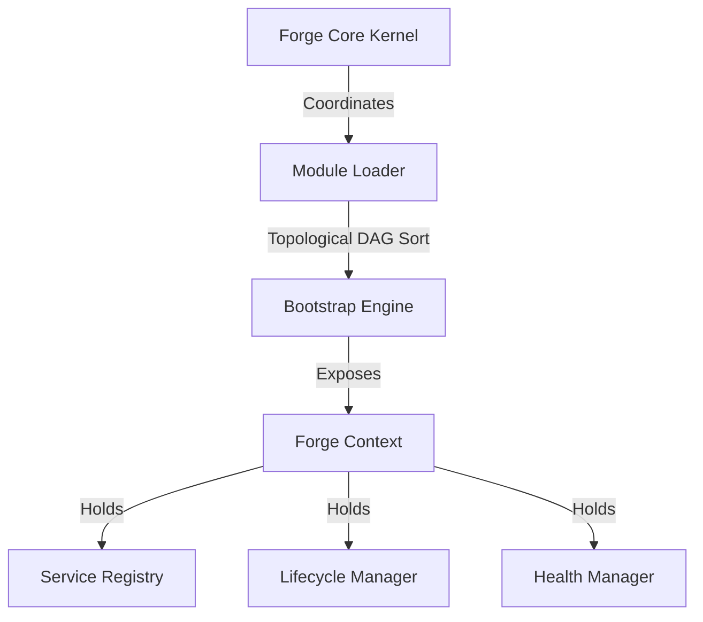

# Subsystem Architecture: Forge Core-Runtime

This document details the architectural specifications, patterns, and design trade-offs implemented in the Forge Core-Runtime subsystem.

---

## 1. System Context & Module Integration

The `core-runtime` acts as the microkernel of ForgeOS, coordinating bootstrap phases, registration of modules, and lifecycle callbacks:

---

## 2. Component Design & Patterns

### A. Modular Bootstrapping via DAG Topological Solver
- **Problem**: Subsystems (VFS, Parser, Memory, Runtime) depend on each other. If VFS boots before Config, it crashes. Hardcoding the startup order creates tight coupling.
- **Pattern**: **Inversion of Control (IoC)** and **Directed Acyclic Graph (DAG)**.
- **Implementation**: Each module declares metadata and dependencies (e.g. `dependencies: ['config']`). The `ModuleLoader` runs a DFS topological sort to construct the correct startup order. If cycles exist, it throws a cyclic exception before boot.
- **Real-World Match**: Similar to dependency resolution in **NestJS** or **Spring ApplicationContext**.

### B. Lifecycle State Machine
- **Problem**: Background tasks must compile and terminate cleanly. Running startup operations out-of-order creates corrupt states.
- **Pattern**: **State Design Pattern**.
- **Implementation**: The `LifecycleManager` controls valid state transitions (`BOOTING` -> `INITIALIZING` -> `STARTING` -> `RUNNING` -> `STOPPING` -> `DISPOSING` -> `STOPPED`). It coordinates asynchronous hook execution.

### C. Safe Service Registry
- **Problem**: Instantiating heavyweight tools (like vector database links) eagerly slows down window load, but resolving lazy modules concurrently can generate race conditions.
- **Pattern**: **Lazy-loaded Singleton Container**.
- **Implementation**: The `ServiceRegistry` caches instances and returning active promises on concurrent resolutions, ensuring only a single singleton is constructed.

### D. Error Boundaries & Retries
- **Problem**: Recoverable errors (timeouts, network drops) shouldn't crash the IDE.
- **Pattern**: **Circuit Breaker / Retry Policy**.
- **Implementation**: Errors inherit from `ForgeError`. `RecoverableError` triggers exponential backoff execution. `FatalError` transitions the system directly to failure and graceful shutdown.

---

## 3. Design Trade-Offs

| Decision | Pros | Cons |
| :--- | :--- | :--- |
| **Topological Startup** | Highly scalable; zero hardcoded dependencies. | Slightly more complex graph traversal during boot. |
| **Pino Logger** | Low-overhead JSON output matching production. | Raw JSON output is less human-readable in development without pretty-print tools. |
| **Lazy Service Instantiation** | Fast boot; memory footprints are minimized. | Resolution latencies occur on first use. |
